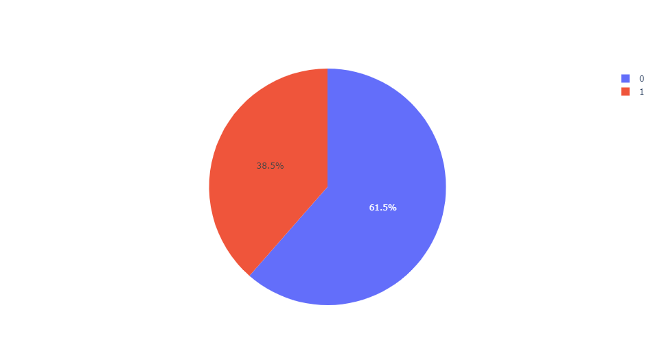
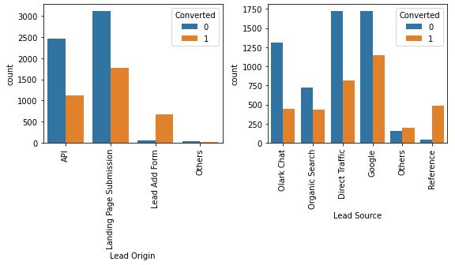
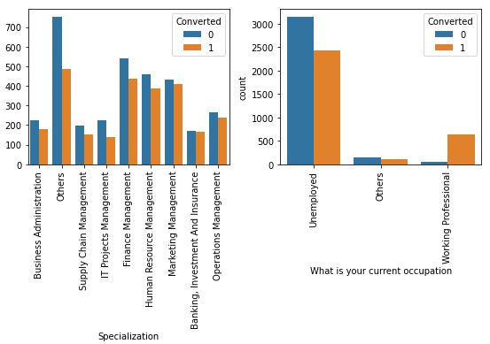
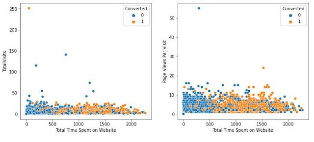
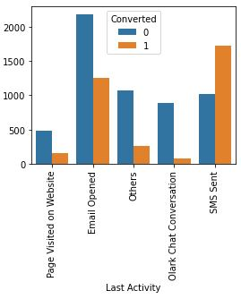

# X-Education Leads Scoring Model
- [Motivation](#Project-Motivation)
- [Installation](#Installation)
- [File Descriptions](#File-Descriptions)
- [Instructions](#How-To-Run-This-Project)
- [Exploratory Data Analysis (EDA)](#EDA)
- [Model Building](#Model)
- [Licensing, Authors, Acknowledgements](#License)

## Project Motivation 
The motivation for this project is to understand factors attracting users and converting them to customers of online courses provided by an education company.

**Background:** X Education provides online courses to industry professionals. Many professionals who are interested in the courses land on the website and browse for courses. X education advertises its courses across several marketing platforms such as Google, Olark chat, etc. Once visitors land on the website, they might perform engagement activities such as browsing courses, filling up forms, or watching some videos. When visitors fill up forms providing their email address or phone number, they get converted to leads. The company also acquires leads through past referrals. Once leads are acquired, employees from the sales team phone and email campaigns. Through this process, a fraction of generated leads get converted into customers. However, the typical lead conversion rate at X education is around 30%, which is something this notebook attempts to improve.

**The goal** of this project is to improve the conversion rate of visitors to customers for X Education. A logistic regression model identifies the impactful marketing and sale factors. The model is to assign a lead score on each lead. The higher the score, the higher the conversion chance.

## Installation 
The following packages and versions are used in this notebook. Any newer versions should work. 
| Package  | Version |
| ------------- | ------------- |
| Python  | 3.8.5  |
| Pandas  | 1.1.3  |
| Numpy   | 1.19.2 |
| Matplotlib | 3.3.2|

## File Description 
There are 4 files in this repository.  
The original dataset and info are provided in `.xlsx` and `.csv` files  
A Jupyter notebook `.ipynb` includes the process of reading in, preprocessing, and modeling the dataset.  
A README.md file as a brief look at this repository.

## Instructions 
* Execute the codes in this notebook and follow along with the insights to understand the decisions made throughout the process.
* The main findings and results of this project can be found in this [post](https://medium.com/@nguyenpham111/tips-to-improve-conversion-rate-for-online-educational-providers-fd84c9a43226)

## Exploratory Data Analysis (EDA) 
The target of the dataset is the `Converted` column indicating whether the customer churned. The labels are imbalanced as observed below.

Figure 1. The current Conversion rate at X Education is 38.5%. Legends: 1 — Converted, 0 — Not converted

EDA was performed to closely analyze the features. In general, a service has different advertising platforms (search engines, social media, prints, etc) and target audiences. By understanding and figuring out the key features, X Education can optimize its marketing campaign to drive the conversion rate and other KPIs

**Advertisement platforms and target audience**  
The first step is to acquire leads. The two charts below lay out the distribution of X Education's advertising platform and current audience. 

Figure 2. Amongst many sources, successfully converted leads are mainly through references.

Figure 3. Working professionals are more likely to convert than unemployed audience

We can see that X Education utilized paid search engines, paid social and even traditional print media. Most converted leads are acquired through its main website where the user **fills out a form** and from **past referrals**. The two primary audiences are **working professionals** and the unemployed, in which the professionals exhibit a significantly high rate of conversion

**Interactive Communication**
After the acquisition, the sale team can focus on nurturing leads by starting emails and message campaigns.

Figure 4. Leads who spent more time on X Education websites are more likely to become customers regardless of their visit frequency and page views. Legends: 1 — Converted, 0 — Not converted

Figure 5. Last activity performed by leads

The data suggests that the total time leads spent on X Education's website highly correlates with the conversion and the audience engages better on SMS and email communication. Therefore, a campaign on improving the website content, users' experience, and strategic communication can boost the conversion rate. 

## Model Building 
A logistic regression model was chosen to train on the given dataset. Since the dataset is highly imbalanced in which there is more label 0 than 1, a precision-recall curve was used to determine the optimal threshold for the classifier.

Figure 5. Precision-recall vs Threshold chart

The optimal threshold is the point that results in the best balance of precision and recall. This is the same as optimizing the F-score. The **best threshold is 0.33** where the *precision is 0.85* and *recall is 0.75*

## Licensing, Authors, Acknowledgements 
* The data set, licensing, and other descriptive information are available on [Kaggle](https://www.kaggle.com/lakshmikalyan/lead-scoring-x-online-education)
