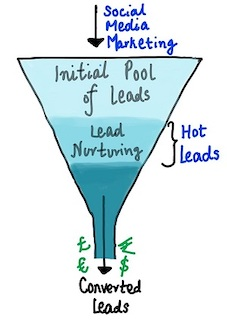
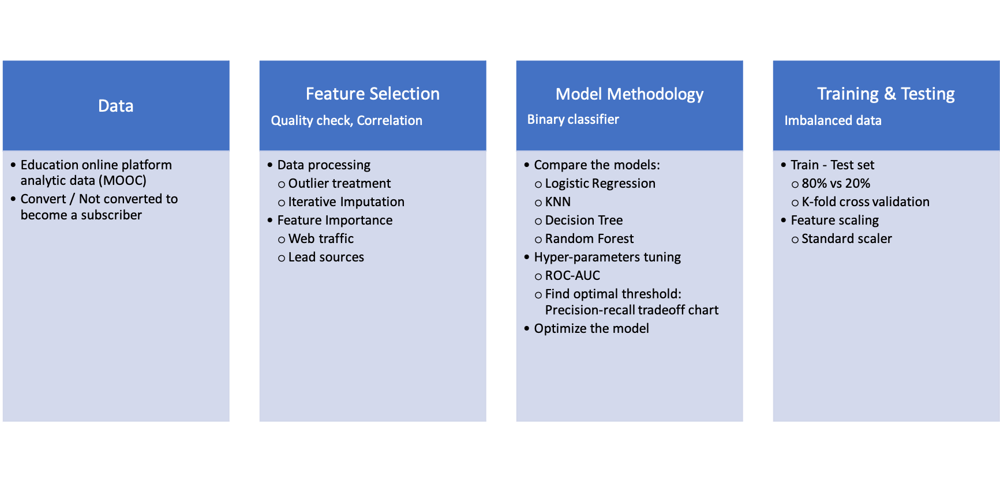
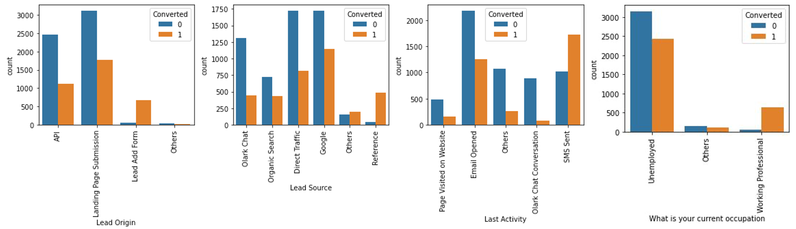
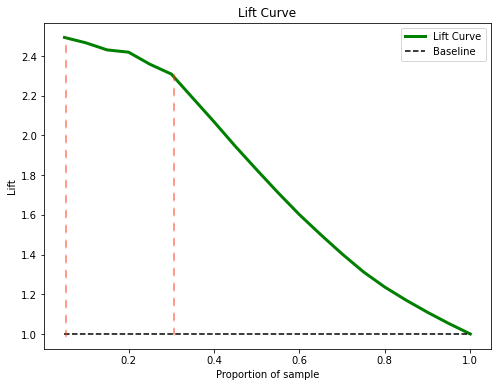

# X-Education Leads Scoring Model
- [Motivation](#Project-Motivation)
- [Project Workflow](#Workflow)
- [Exploratory Data Analysis (EDA)](#EDA)
- [Data Processing](#Processing)
- [Model Building](#Model)
- [Licensing, Authors, Acknowledgements](#License)

## Project Motivation 
The motivation for this project is to understand factors attracting users and converting them to customers of online courses provided by an education company.

**Background:** X Education provides online courses to industry professionals. Many professionals who are interested in the courses land on the website and browse for courses. X education advertises its courses across several marketing platforms such as Google, Olark chat, etc. Once visitors land on the website, they might perform engagement activities such as browsing courses, filling up forms, or watching some videos. When visitors fill up forms providing their email address or phone number, they get converted to leads. The company also acquires leads through past referrals. Once leads are acquired, employees from the sales team phone and email campaigns. Through this process, a fraction of generated leads get converted into customers. However, the typical lead conversion rate at X education is around 30%, which is something this notebook attempts to improve.

**The goal** of this project is to improve the conversion rate of visitors to customers for X Education by building a predictive classification model. A *logistic regression model* identifies the impactful marketing and sales factors. The model is to assign a lead score on each lead. The higher the score, the higher the conversion chance.

 
Leads to Customers Conversion Funnel.

## Project Workflow 
 
Figure 1. Workflow to build a classification model to improve the conversion rate of leads to customers for X-Education online platform

## Exploratory Data Analysis (EDA) 
The current conversion rate at X Education is 38.5%. 

The target of the dataset is the 'Converted' column indicating whether the customer churned. The labels are imbalanced as observed below. An overview of the dataset:
- Some categorical features have more than 45% missing values and some with very few variations in values.
- Some numerical features contain outliers and missing values that need to be evaluated on how to be best imputed.
  
## Data Processing 
The following steps were taken to process and prepare the data for visualization and model building.
- Outliers treatment by capping the outliers with left and right limits
- Impute missing values with scikit-learn InterativeImputer (each feature is modeled as a function of the other features)

**Leads acquisition**  
The first step is to acquire leads. The two charts below lay out the distribution of X Education's advertising platform and current audience. 

 
Figure 2. Amongst many sources, successfully converted leads are mainly through references and those who fill out the application form. Besides, working professionals are more likely to convert than unemployed audience

After the acquisition, the sales team can focus on nurturing leads by starting emails and message campaigns.
 
Figure 3. Leads who spent more time on X Education websites are more likely to become customers regardless of their visit frequency and page views. Legends: 1 — Converted, 0 — Not converted

**Key Findings**
- Total time leads spent on X Education's website highly correlates with the conversion
- Most converted leads came from past referrals and website form submission
- The audience engages better in SMS and email communication
--> Therefore, a campaign on improving the website content, users' experience, and strategic communication can boost the conversion rate. 

## Model Building 
I compared the performance of 4 classification models: logistic, KNN, decision tree, and random forest. Logistic, random forest and KNN models scored high in accuracy, precision, and recall, respectively. 

*Logistic regression* model is chosen for its simplicity. Due to the imbalance in the target labels, a precision-recall tradeoff analysis is more appropriate to identify the optimal threshold for the classifier. 

 
Figure 4. Precision-recall vs. Threshold chart

The optimal threshold is the point that results in the best balance of precision and recall. This is the same as optimizing the F-score. The **best threshold is 0.37** where the *precision is 0.85* and *recall is 0.80*

 
Figure 7. The lift chart analyzed from the test set with a baseline rate of 1% (sending promotions to the entire sample population)

**Suggestion** Target the top 10% - 30% of the population will potentially result in a 2.3 - 2.5X lift in response rate

## Licensing, Authors, Acknowledgements 
* The main findings and results of this project can be found in this [post](https://medium.com/@nguyenpham111/tips-to-improve-conversion-rate-for-online-educational-providers-fd84c9a43226)
*  The data set, licensing, and other descriptive information are available on [Kaggle](https://www.kaggle.com/lakshmikalyan/lead-scoring-x-online-education)
